# Tutorial 4 - Basic 2D Level Design

Selamat datang pada tutorial keempat kuliah Game Development. Pada tutorial
kali ini, kamu akan mempelajari cara membuat level sederhana menggunakan Godot Engine.
Di akhir tutorial ini, diharapkan kamu paham dengan penggunaan _TileMap_ dan _Signals_

## Daftar Isi

- [Tutorial 4 - Basic 2D Level Design](#Tutorial-4---Basic-2D-Level-Design)
  - [Daftar Isi](#daftar-isi)
  - [Pengantar](#pengantar)
    - [What Is a Level?](#What-Is-a-Level)
    - [Level Example](#Level-Example)
  - [Creating A Simple Level using TileMap](#Creating-A-Simple-Level-using-Tilemap)
    - [Preparation](#Preparation)
    - [Making Tile Set](#Making-Tile-Set)
    - [Paint the TileMap](#Paint-the-TileMap)
  - [Making the Camera Follows The Player](#Making-the-Camera-Follows-The-Player)
    - [How Simple It Is](#How-Simple-It-Is)
  - [Referensi](#referensi)

## Pengantar

### What Is a Level?

Pada tutorial sebelumnya kita sudah membuat sebuah _player_ sederhana yang dapat bergerak ke kanan dan kiri dan juga dapat melompat. 
Namun tempat ia bergerak masih sangat terbatas, kita memerlukan sebuah _level_ supaya _player_ tidak hanya jatuh ke jurang tanpa dasar.

Sebuah _level_ pada dasarnya adalah tempat dimana _player_ dapat melakukan _action_ dan mungkin memiliki sebuah _goal_.

### Level Example

Contoh sebuah level yang terlihat sederhana:

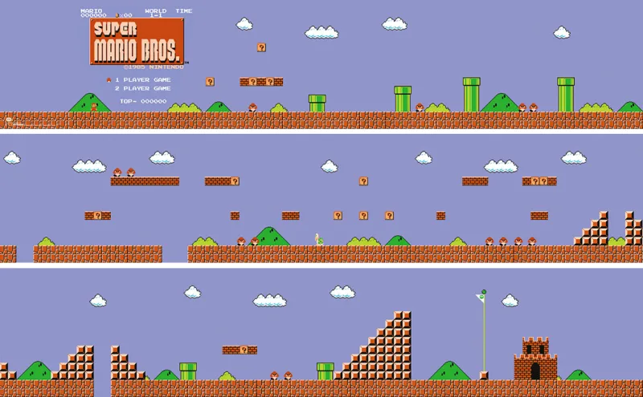

> Super Mario Bros World 1-1, Nintendo 1985

Kita akan membuat sebuah level 2D sederhana menggunakan salah satu fitur Godot Engine yaitu _TileMapLayer_.
Pada tutorial ini akan didemonstrasikan:
- Membuat TileSet untuk TileMapLayer
- Membuat level menggunakan TileMapLayer
- Membuat kamera mengikuti player
- Membuat trigger untuk lose dan win condition

## Creating A Simple Level using TileMap

### Preparation

Buka template project di Godot Editor, kemudian buka scene ```Level 1.tscn```.
Dalam scene tersebut akan terdapat suatu mahluk yang hanya akan jatuh jika scene dimainkan.

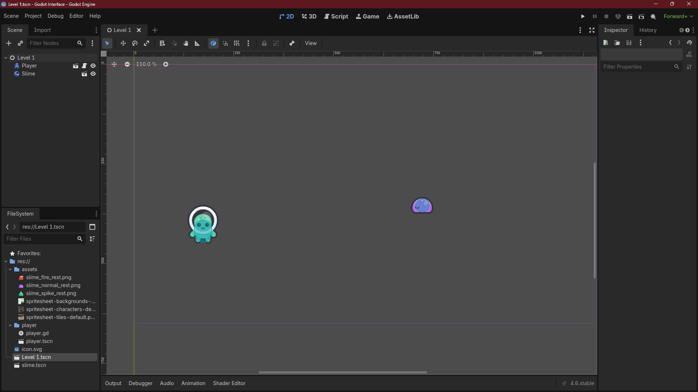

Klik kanan pada node ```Level 1``` dan pilih ```Add Child Node```, kemudian pilih ```TileMapLayer```.

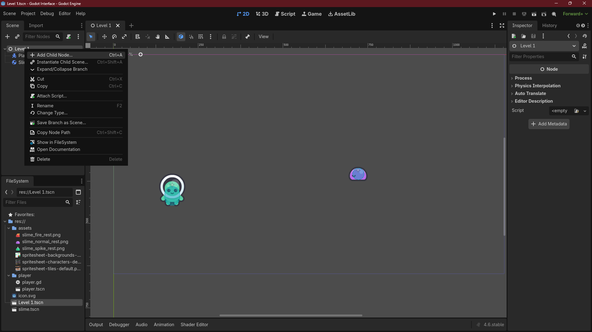
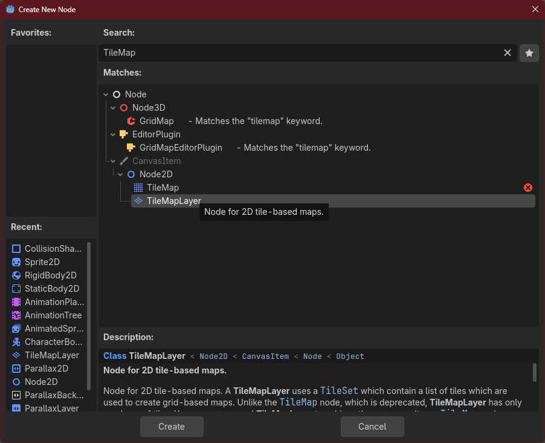

Setelah `TileMapLayer` berhasil ditambahkan akan terlihat _grid_ berwarna oranye pada scene dan muncul 1 tab baru disebelah scene.
(Jika tidak terjadi apa-apa, coba select node TileMap)

### Making Tile Set

Jika diibaratkan dengan melukis, kita baru saja mempersiapkan kanvas dan kuas. Kita masih kekurangan cat untuk melukis.
Untuk mempersiapkan cat, pada tab Inspector klik dropdown menu ```Tile Set``` dan pilih ```New TileSet```.

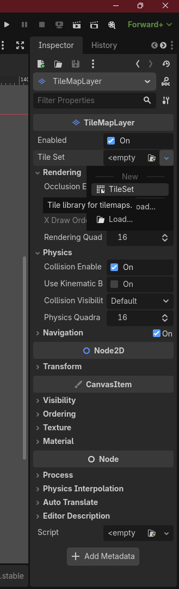

Ganti nilai dari Tile Size dari 16 x 16 jadi 64 x 64.

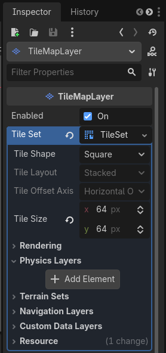

Dibagian bawah akan muncul tab baru dengan nama ```TileSet```.

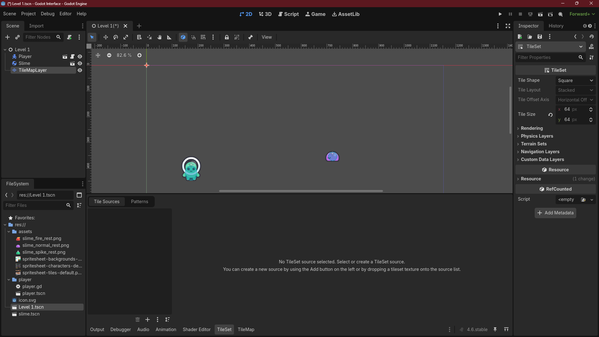

Lalu klik ikon plus di kiri bawah window tersebut dan pilih ```assets/spritesheet-tiles-default.png```.

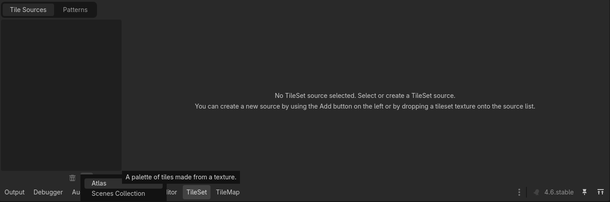

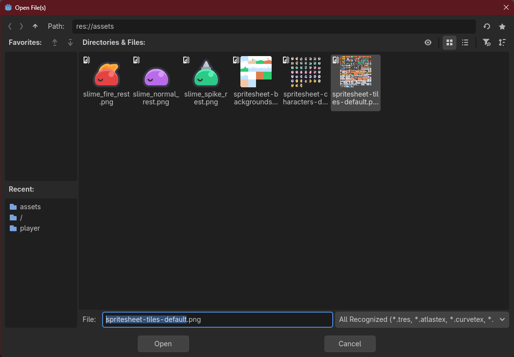

Lalu ubah nilai separation menjadi 1x1

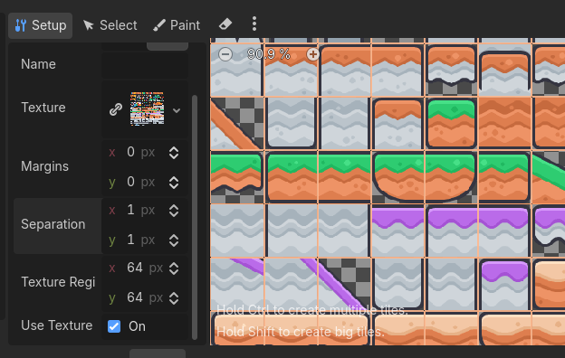

### Paint the TileMap

Jika sudah berhasil, klik node TileMap pada tab Scene dan Tile Set tadi akan tampil dan siap untuk digunakan.
Kalian bisa memilih tile yang ada pada tab TileMap kemudian mulai click and drag pada viewport scene untuk
menambahkan tile tersebut pada scene kalian.


### Adding collision

Saat ini tiles kita belum memiliki collision dan player dan slime akan tembus ketika jatuh. Sebelum itu
kita perlu menambahkan physics layer pada `TileMapLayer` terlebih dahulu.


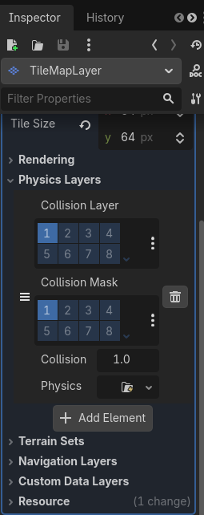

Lalu pada tab tileset di bagian bawah pilih tab select. Kemudian pilih salah satu tile yang akan digunakan
pada scene kalian. Klik bagian physics dari tile tersebut. Kemudian pada ikon titik tiga pilih reset to default tile shape.
Lakukan hal tersebut ke semua tile yang akan digunakan.

https://github.com/user-attachments/assets/5087848b-2312-4c2c-aab6-4aa7203753e7

## Making the Camera Follows The Player

Sekarang kita sudah memiliki sebuah level, namun jika scene di-_play_ kamera akan diam di tempat awal dan membatasi apa yang bisa dilihat.
Oleh karena itu kita akan membuat kamera yang akan mengikuti kemanapun mahluk pink itu pergi.

### How Simple It Is

Buka scene ```Scenes/Player.tscn```, tambah node ```Camera2D``` sebagai child dari ```Player```.
Kemudian pada tab Inspector centang ```Current```.
That's it, you're done.


Sekarang kamera akan selalu mengikuti mahluk itu kemanapun ia pergi.


## Referensi

- [Tilemaps](https://docs.godotengine.org/en/4.6/tutorials/2d/using_tilemaps.html)
- [Signals](https://docs.godotengine.org/en/4.6/getting_started/step_by_step/signals.html)
- [Kenney Assets](https://www.kenney.nl/assets/platformer-pack-redux)
- Materi tutorial pengenalan Godot Engine, kuliah Game Development semester
  gasal 2020/2021 Fakultas Ilmu Komputer Universitas Indonesia.
